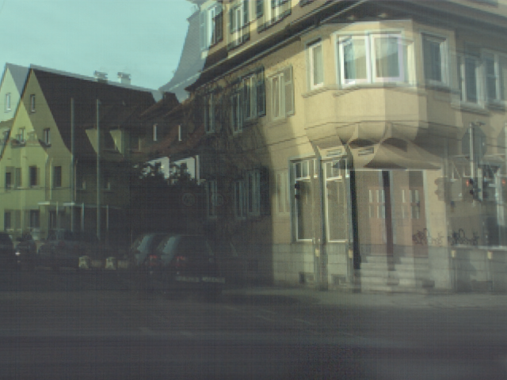

# Inverting a Rolling Shutter Camera: Bring Rolling Shutter Images to High Framerate Global Shutter Video

This repository contains the source code for the paper: [Inverting a Rolling Shutter Camera: Bring Rolling Shutter Images to High Framerate Global Shutter Video (ICCV2021)](https://openaccess.thecvf.com/content/ICCV2021/papers/Fan_Inverting_a_Rolling_Shutter_Camera_Bring_Rolling_Shutter_Images_to_ICCV_2021_paper.pdf)

 

 

## Installation
Install the dependent packages:
```
pip install -r requirements.txt
```
The code is tested with PyTorch 1.6.0 with CUDA 10.2.89.

Note that in our implementation, we borrowed some packages from [DeepUnrollNet](https://github.com/ethliup/DeepUnrollNet) and [SelfDeblur](https://github.com/ethliup/SelfDeblur) as follows:

#### Install correlation package
```
cd ./package_correlation
python setup.py install
```
#### Install differentiable forward warping package
```
cd ./package_forward_warp
python setup.py install
```
#### Install core package
```
cd ./package_core
python setup.py install
```
#### Install reblur_package
```
cd ./reblur_package
python setup.py install
```
## Demo with our pretrained model
Please download the [pretrained model](https://drive.google.com/drive/folders/1_ScKNMYztcQDriG7OzNBGXvZ1PqKOSo9?usp=sharing) and unzip these three subfolders to the `deep_unroll_weights` folder of the main directory.

You can now test our model with the provided images in the `demo` folder.

To generate the global shutter images corresponding to the middle and first scanlines, simply run
```
sh demo.sh
```
To generate multiple global shutter video frames, e.g. 10× temporal upsampling, please run
```
sh demo_video.sh
```
The visualization results will be stored in the `experiments` folder. Note that additional examples in the dataset can be tested similarly.

## Datasets
- **Carla-RS** and **Fastec-RS:** Download them to your local computer from [here](https://github.com/ethliup/DeepUnrollNet).

## Training and evaluating
You can run following commands to re-train the network.
```
# !! Please update the corresponding paths in 'train_carla.sh' and 'train_fastec.sh' with  #
# !! your own local paths, before run following command!!      #

sh train_carla.sh
sh train_fastec.sh
```

You can run following commands to obtain the quantitative evaluations.
```
# !! Please update the path to test data in 'inference.sh'
# !! with your own local path, before run following command!!

sh inference.sh
```
Note that `--load_1st_GS=0` denotes the correction evaluation corresponding to the middle scanline of second RS frame, and `--load_1st_GS=1` denotes the correction evaluation corresponding to the first scanline of second RS frame.

## Citations
Please cite our paper if necessary:
```
@inproceedings{fan_RSSR_ICCV21,
  title={Inverting a rolling shutter camera: bring rolling shutter images to high framerate global shutter video},
  author={Fan, Bin and Dai, Yuchao},
  booktitle={Proceedings of the IEEE/CVF International Conference on Computer Vision},
  pages={4228--4237},
  year={2021}
}
```

## Statement
This project is for research purpose only, please contact us for the licence of commercial use. For any other questions or discussion please contact: binfan@mail.nwpu.edu.cn
