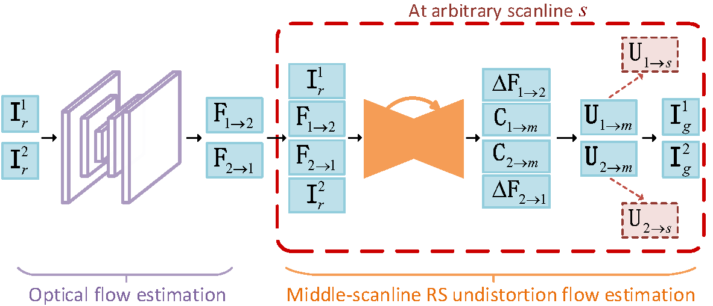

# RSSR: Rolling shutter temporal super-resolution (ICCV2021)
Inverting a Rolling Shutter Camera: Bring Rolling Shutter Images to High Framerate Global Shutter Video



# Code
Code will be released very soon.

# Our Bib:

Please cite our paper if necessary:
```
@inproceedings{fan_rssr21,
  title={Inverting a Rolling Shutter Camera: Bring Rolling Shutter Images to High Framerate Global Shutter Video},
  author={Fan, Bin and Dai, Yuchao},
  booktitle={Proceedings of the International Conference on Computer Vision (ICCV)},
  year={2021}
}
```

# Contact

Please drop me an email for further problems or discussion: binfan@mail.nwpu.edu.cn
